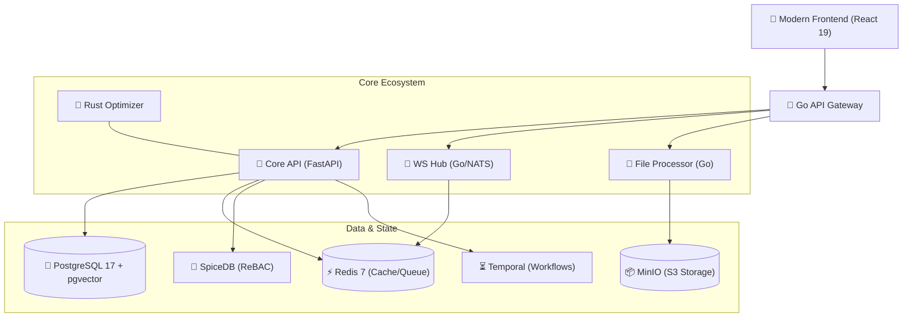

<div align="center">

# 🎓 University Ecosystem Platform
### *The Ultimate Digital Hub for Modern Campus Life*

[](https://opensource.org/licenses/MIT)
[](https://www.python.org/)
[](https://fastapi.tiangolo.com/)
[](https://react.dev/)
[](https://go.dev/)
[](https://www.rust-lang.org/)
[](https://www.postgresql.org/)

---

**University Ecosystem** is a high-performance, polyglot microservices platform engineered to centralize and revolutionize student interactions. From real-time scheduling and interactive campus navigation to enterprise-grade security and automated workflows, we provide the digital foundation for the next generation of academic excellence.

[Explore Docs](docs/README.md) • [Deployment Guide](docs/DEPLOY.md) • [Security Policy](SECURITY.md) • [Contributing](docs/CONTRIBUTING.md)

</div>

## 🌟 Visionary Features

> [!IMPORTANT]
> This platform is not just an app; it's a living ecosystem designed for extreme scalability and fault tolerance.

- 📅 **Dynamic Academic Engine** – Real-time scheduling with atomic academic calendar synchronization.
- 💬 **Quantum-Speed Hub** – High-concurrency WebSockets via Go + NATS for instant updates and collaborative chat.
- 🔒 **Relationship-Based Auth (ReBAC)** – Granular, logic-based permissions powered by **SpiceDB**.
- 🖼️ **Media Intelligence** – Automated image optimization and malware scanning via **imgproxy** and **ClamAV**.
- ⚡ **Rust-Optimized Core** – Near-zero latency execution for computationally intensive university logic.
- 🗺️ **Vectorized Campus Navigation** – Context-aware search and routing using **pgvector**.
- ⏳ **Atomic Workflows** – Complex enrollment and grading processes orchestrated by **Temporal.io**.

## 🏗️ Polyglot Architecture

The platform exploits the strengths of multiple modern runtimes to achieve a superior balance of development speed and execution performance.



## 🛠️ Technological Dominance

| Layer | Technologies | Primary Role |
| :--- | :--- | :--- |
| **Frontend** | React 19, Vite, Framer Motion, Tailwind CSS, TanStack Query | Slick, responsive UX & PWA support |
| **Backend API** | FastAPI, Python 3.13, Dishka (DI), SQLAlchemy 2.0 | High-level business logic & REST/GraphQL |
| **Microservices** | Go 1.26, NATS JetStream, gRPC | Blazing fast concurrency & service-to-service |
| **Performance** | Rust, PyO3, Maturin | Native-speed optimizations for Python tasks |
| **Security** | SpiceDB, AuthZed, WebAuthn, JWT | Enterprise ReBAC & Hardware/MFA Auth |
| **Infrastructure** | Docker Compose, Temporal, MinIO, OpenTelemetry | Reliability, Workflows, & Global Observability |

## 🚀 Rapid Onboarding

### 1. Secure Environment Setup
We utilize [Mozilla SOPS](https://github.com/getsops/sops) to ensure that secrets are never exposed in plain text.
```powershell
# Decrypt the environment template (requires age/PGP setup)
sops -d .env.enc > .env
```

### 2. Ignition
Launch the entire ecosystem with a single command:
```bash
docker compose up --build
```

### 🌐 Access Points
- **Digital Hub**: [http://localhost:8081](http://localhost:8081)
- **API Blueprints**: [http://localhost:8000/api/docs](http://localhost:8000/api/docs)
- **Real-time Signal**: `ws://localhost:8082`
- **Observability Hub**: [http://localhost:8000/metrics](http://localhost:8000/metrics)

## 🧪 Developer Workflow

> [!TIP]
> We value clean code and strict typing. Always run linters before pushing.

### **Python (Core API)**
```bash
uv sync            # Dynamic dependency sync
uv run pytest      # Execute the test pyramid
make lint-backend  # Enforce Ruff & Mypy standards
```

### **React (Frontend)**
```bash
cd frontend
npm install        # Rehydrate dependencies
npm run dev        # Launch Vite dev server
npm run test       # Run Vitest suite
```

### **Go (Microservices)**
```bash
cd services/gateway
go test ./...      # Verify Go logic
go build -o uni-gw # Compile production binary
```

## 🔭 Observability & Excellence

We don't just ship; we monitor. The ecosystem is fully instrumented with:
- **OpenTelemetry**: Distributed tracing across all microservices.
- **Sentry**: High-fidelity error tracking and performance profiling.
- **Prometheus**: Real-time metrics for every system component.
- **SonarCloud**: Continuous code quality and security analysis.

---

<div align="center">
  <br />
  <h3>Built with ❤️ by University Ecosystem Architects</h3>
  © 2026 University Ecosystem Platform • All Rights Reserved.
</div>

