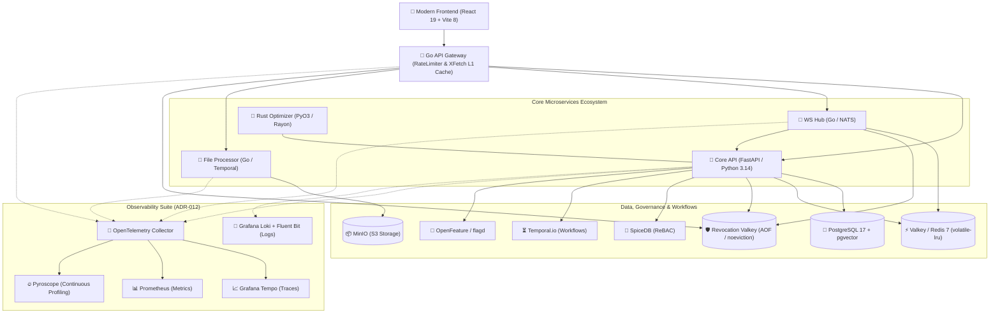
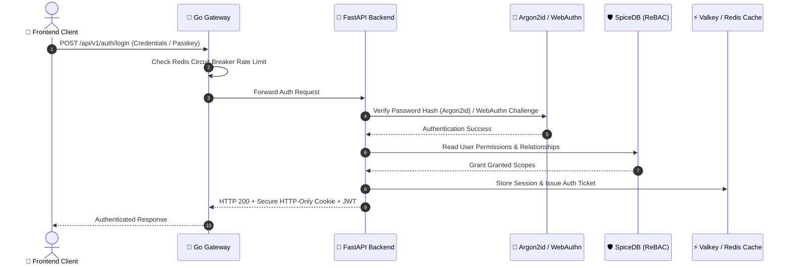
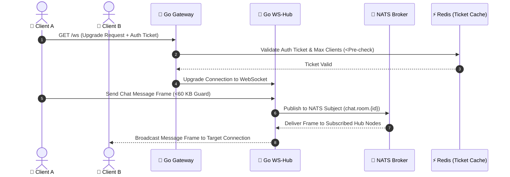

<div align="center">

# 🎓 University Ecosystem Platform
### *The Ultimate Digital Hub for Modern Campus Life*

<p align="center">
  <a href="README.md"><b>English 🇬🇧</b></a> • 
  <a href="README.ru.md"><b>Русский 🇷🇺</b></a>
</p>

[](https://opensource.org/licenses/MIT)
[](https://www.python.org/)
[](TESTING.md)
[](TESTING.md)
[](TESTING.md)
[](TESTING.md)
[](https://react.dev/)
[](https://vitejs.dev/)
[](https://go.dev/)
[](https://www.postgresql.org/)
[](SECURITY.md)

---

**University Ecosystem** is a high-performance, polyglot microservices platform engineered to centralize and revolutionize student interactions. From real-time scheduling and interactive campus navigation to enterprise-grade security and automated workflows, we provide the digital foundation for the next generation of academic excellence.

[Explore Docs](docs/README.md) • [Deployment Guide](docs/DEPLOY.md) • [Testing Guide](TESTING.md) • [Security Policy](SECURITY.md) • [Contributing](docs/CONTRIBUTING.md)

</div>

## 🌟 Visionary Features

> [!IMPORTANT]
> This platform is not just an app; it's a living ecosystem designed for extreme scalability, zero-trust security, and high-concurrency fault tolerance.

- 📅 **Dynamic Academic Engine** – Real-time scheduling powered by a **Rust (PyO3)** native extension using Rayon parallel threads for instant timetable conflict resolution.
- 💬 **High-Concurrency Real-Time Hub** – High-throughput WebSockets via **Go + NATS**, featuring JWKS hot-reloading, 60 KB frame caps, and max-client pre-checks.
- 🔒 **Relationship-Based Auth (ReBAC)** – Granular, Zanzibar-inspired permission management powered by **SpiceDB** alongside **OpenFeature** + **flagd** feature flags.
- 🖼️ **Media Intelligence & Workflows** – Asynchronous background processing, image optimization, and malware scanning via **Go file-processor**, **Temporal.io**, **MinIO**, and **ClamAV**.
- ⚡ **XFetch L1/L2 Probabilistic Caching** – Rate-limiting circuit breakers and probabilistic cache refresh preventing cache stampedes across Redis/Valkey (`volatile-lru`).
- 🗺️ **Vectorized Search & Navigation** – Context-aware semantic search and campus routing leveraging **pgvector** and OpenAI/custom embedding providers.
- 📊 **Full-Spectrum Observability** – End-to-end distributed tracing (**OTEL + Tempo**), metrics (**Prometheus**), profiling (**Pyroscope**), and centralized logs (**Grafana Loki + Fluent Bit**).

## ⚡ Performance & Benchmarks

Our polyglot architecture maximizes throughput while maintaining low resource usage:

| Subsystem / Metric | Pure Python / Standard | Polyglot Core (Rust / Go) | Performance Gain |
| :--- | :---: | :---: | :---: |
| **Schedule Conflict Solver** (10,000 items) | ~45.2 ms (Single-thread) | **<0.98 ms** (Rust PyO3 + Rayon) | **~46x Faster** 🚀 |
| **WebSocket Throughput (`ws-hub`)** | ~2,500 req/sec (Single Node) | **10,000+ req/sec** (<5ms latency) | **4x Concurrency** ⚡ |
| **L1 Cache Refresh (`gateway`)** | Traditional TTL (Stampede Risk) | **XFetch Probabilistic Refresh** | **0 Stampedes** 🛡️ |
| **Frontend Bundle Budget** | ~1.4 MB (Standard Rollup) | **<485 KB** (Vite 8 / Rolldown + Oxc) | **65% Smaller** 📦 |

## 📂 Project Structure

```text
university_ecosystem/
├── app/               # 🐍 Core API (Python 3.14 / FastAPI) - Business Logic & GraphQL
├── frontend/          # ⚛️ Modern Web UI (React 19 + Vite 8/Rolldown + Valibot)
├── services/
│   ├── gateway/       # 🚀 API Gateway (Go) - Auth, L1 XFetch Cache & Rate Limits
│   ├── ws-hub/        # 📡 WebSocket Hub (Go/NATS) - High-Concurrency Real-time Messaging
│   ├── file-processor/# 📁 Media Engine (Go/Temporal) - Secure Uploads & Processing
│   └── caddy/         # 🔒 Edge Reverse Proxy & TLS Termination
├── native/            # 🦀 Rust Extensions (PyO3/Rayon) - High-Performance Hot Path
├── k8s/               # ☸️ Kubernetes Helm Charts, Kyverno Policies & Chaos Mesh
├── alembic/           # 🗄️ Database Migrations (SQLAlchemy 2.0 Async)
└── docs/              # 📖 Architecture Specs & ADRs (ADR-001 — ADR-032)
```

## 🧠 Architectural Philosophy

Why the polyglot approach?
- **Python (FastAPI & Python 3.14)**: Selected for development velocity, Dishka dependency injection, rich ecosystem, and async processing for complex business logic.
- **Go (Golang)**: Powers I/O-bound microservices (`gateway`, `ws-hub`, `file-processor`) to handle thousands of concurrent WebSocket connections and gRPC streams with minimal footprint.
- **Rust (PyO3 & Rayon)**: Integrated directly into Python for CPU-heavy hot paths (e.g., timetable conflict resolution and partition management) where microsecond performance is critical.
- **SpiceDB (ReBAC)**: Implements Zanzibar-inspired relationship-based access control (e.g., *"Student X can view Course Y because they belong to Group Z"*).
- **Vite 8 & Rolldown**: Delivers ultra-fast frontend builds, React Compiler optimizations, and lightweight bundles (<500 KB JS budget).

## 🏗️ Architecture & Core Sequence Flows

### System Topology



### 🔐 Zero-Trust Authentication Sequence



### 📡 High-Concurrency Real-Time Chat Sequence



## 🛠️ Technological Stack

| Layer | Technologies | Primary Role | Coverage Gate |
| :--- | :--- | :--- | :---: |
| **Frontend** | React 19, Vite 8/Rolldown, Valibot, Framer Motion, TanStack | Matte UX, accessibility (WCAG 2.2 AA), PWA | **100%** |
| **Backend API** | FastAPI, Python 3.14, Dishka DI, SQLAlchemy 2.0, GraphQL | Core business logic, REST & GraphQL APIs | **100%** |
| **Microservices** | Go 1.26, NATS, gRPC, Temporal Go SDK | High-concurrency WebSockets & media orchestration | **100%** |
| **Native Performance**| Rust, PyO3, Rayon, Maturin | Microsecond-speed schedule conflict solver & HMAC | **100%** |
| **Auth & Security** | Argon2id, SpiceDB, WebAuthn/Passkeys, Kyverno, CSRF nonces | Zero-trust ReBAC, hardware MFA & policy enforcement | Verified |
| **Data & Cache** | PostgreSQL 17, pgvector, cache Valkey (`volatile-lru`), revocation Valkey (AOF, `noeviction`) | Relational/vector data, probabilistic L1/L2 caching, and isolated durable auth revocation | Verified |
| **Observability** | OTEL, Tempo, Prometheus, Pyroscope 1.19, Loki + Alloy/Fluent Bit | Complete 360° tracing, metrics, profiling & logging | Verified |

## 🚀 Rapid Onboarding

### 1. Secure Environment Setup
We utilize [Mozilla SOPS](https://github.com/getsops/sops) to ensure environment secrets remain encrypted at rest.
```powershell
# Decrypt the environment template (requires age/PGP setup)
sops -d .env.enc > .env
```

### 2. Ignition
Launch the entire ecosystem through the PowerShell 7 bootstrapper. It creates
local secrets, reconciles persistent infrastructure, builds images, and waits
for every runtime and Prometheus target:
```powershell
.\start-docker.ps1 -Build
```

### 🌐 Access Points
- **Digital Hub (Caddy edge)**: [http://localhost](http://localhost)
- **Frontend SSR debug port**: [http://localhost:8081](http://localhost:8081)
- **Core API documentation**: [http://localhost:8000/docs](http://localhost:8000/docs)
- **Go Gateway Entry**: [http://localhost:8080](http://localhost:8080)
- **Real-Time Signal**: `ws://localhost:8083/ws`
- **Observability Hub**: [Grafana](http://localhost:3000) · [Prometheus](http://localhost:9090) · [Pyroscope](http://localhost:4040)

## 🛡️ Security & Quality Pillars

- **Hardware/Passkey Auth**: Native **WebAuthn/FIDO2** support alongside **Argon2id** password hashing.
- **Strict Input Validation**: Client-side **Valibot** schemas and gRPC path traversal guards (RZ-27-04).
- **Malware & SSRF Protection**: In-memory **ClamAV** scanning and strict URL validation blocking internal IP ranges.
- **Zero-Trust Network Policies**: Kubernetes **Kyverno** admission policies and pod security profiles (`RuntimeDefault`).
- **Sanitized Logging**: Automated PII redaction (`_redact_pii`) stripping emails and phone numbers from logs.

## 🧪 Developer Workflow

### **Python (Core API)**
```bash
uv sync            # Sync Python 3.14 dependencies
uv run pytest      # Run full pytest suite (2800+ tests)
python -m ruff check app/   # Run Ruff linter
python -m ruff format app/  # Format Python codebase
```

### **React (Frontend)**
```bash
cd frontend
npm install        # Hydrate frontend dependencies
npm run dev        # Start Vite 8 dev server
npx tsc --noEmit   # Typecheck TypeScript
npm run test       # Run Vitest test suite
```

### **Go (Microservices)**
```bash
cd services/gateway
go test ./...      # Test Go Gateway logic
make test-integration # Run ADR-022 Testcontainers suite
```

## 🔭 Observability & Continuous Monitoring

The platform includes a production-ready observability stack:
- **OpenTelemetry & Tempo**: End-to-end distributed tracing across Go microservices and FastAPI.
- **Prometheus**: Real-time metrics including L1 cache hit/miss rates (`cache_l1_hits_total`).
- **Pyroscope**: Continuous CPU/Memory profiling (`grafana/pyroscope:1.19.1`).
- **Grafana Loki + Fluent Bit**: Structured centralized log aggregation (ADR-012).

---

<div align="center">
  <br />
  <h3>Built with ❤️ by University Ecosystem Engineers</h3>
  © 2026 University Ecosystem Platform • All Rights Reserved.
</div>
