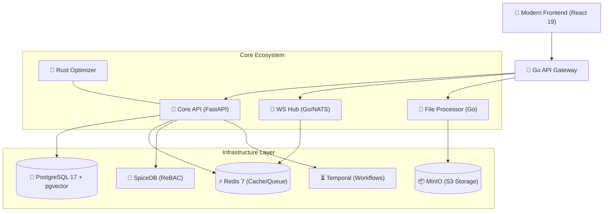

<div align="center">


# 🎓 University Ecosystem Platform
### *The Ultimate Digital Hub for Modern Campus Life*

[](https://opensource.org/licenses/MIT)
[](https://www.python.org/)
[](https://fastapi.tiangolo.com/)
[](https://react.dev/)
[](https://go.dev/)
[](https://www.rust-lang.org/)

---

**University Ecosystem** is a high-performance, microservices-oriented platform designed to centralize and enhance university experiences. From real-time scheduling and interactive campus maps to secure file processing and instant notifications, we provide the digital infrastructure for the modern student.

</div>

## ✨ Key Features

- 📅 **Dynamic Scheduling** – Real-time academic calendars and event tracking.
- 💬 **Real-time Hub** – High-speed WebSockets for chat and instant updates.
- 🔒 **Enterprise-Grade Auth** – Relationship-based access control (ReBAC) via SpiceDB.
- 🖼️ **Media Mastery** – On-the-fly image optimization and secure file processing.
- ⚡ **Rust-Powered** – Computationally intensive tasks optimized with Rust.
- 🔔 **Push Notifications** – Cross-platform alerts for critical university updates.
- 🗺️ **Campus Navigation** – Integrated links and maps for seamless movement.

## 🏗️ Architecture Overview

The platform is built on a decentralized, polyglot microservices architecture designed for extreme scalability and resilience.



## 🛠️ Technology Stack

| Layer | Technologies |
| :--- | :--- |
| **Frontend** | React 19, Vite, Framer Motion, Tailwind CSS, TanStack Query |
| **Backend** | FastAPI, Go 1.26, Rust, Dishka (DI), SQLAlchemy |
| **Real-time** | Go, NATS, WebSockets |
| **Security** | SpiceDB (AuthZ), JWT, WebAuthn, Argon2 |
| **Data** | PostgreSQL 17, pgvector, Redis, Elasticsearch |
| **Infrastructure** | Docker, Temporal, MinIO, imgproxy, OpenTelemetry |

## 🚀 Getting Started

### 1. Environment Configuration
Copy the template and configure your secrets:
```bash
cp .env.example .env
```

### 2. Launch the Ecosystem
We use Docker Compose for a seamless full-stack experience:
```bash
docker compose up --build
```

### 🌐 Service Endpoints
- **Frontend UI**: [http://localhost:8081](http://localhost:8081)
- **API Documentation**: [http://localhost:8000/api/docs](http://localhost:8000/api/docs)
- **Metrics Dashboard**: [http://localhost:8000/metrics](http://localhost:8000/metrics)
- **WS Hub**: [ws://localhost:8082](ws://localhost:8082)

## 🧪 Development Workflow

### **Backend (Python)**
```bash
uv sync            # Fast dependency management
uv run pytest      # Run the test pyramid
make lint          # Maintain code quality
```

### **Frontend**
```bash
cd frontend
npm install
npm run dev
```

### **Go Microservices**
```bash
cd services/ws-hub
go test ./...
go build
```

---

## 📖 Deep Dives
- [📘 Deployment Guide](docs/DEPLOY.md)
- [🌍 Localization Guidelines](docs/LOCALIZATION.md)
- [🔭 Observability Setup](docs/observability/)
- [🤝 Contributing](docs/CONTRIBUTING.md)

<div align="center">
  <br />
  © 2026 University Ecosystem Team • Generated with ❤️ for the future of education.
</div>
