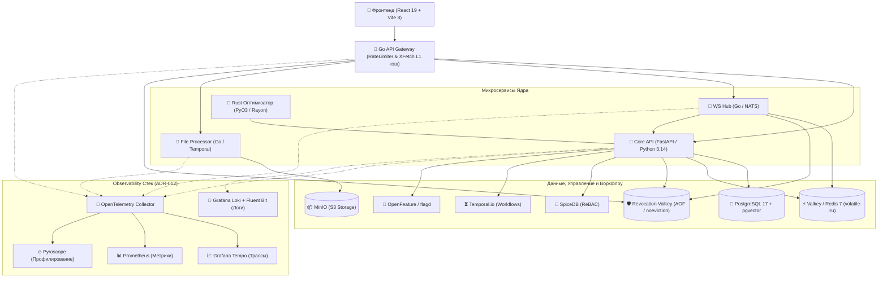
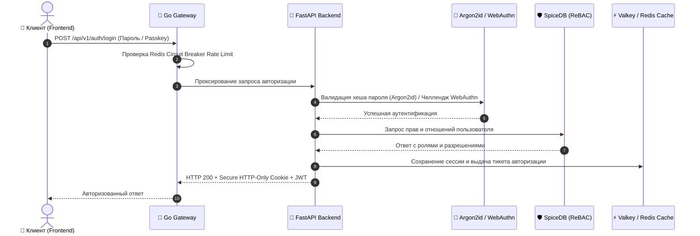
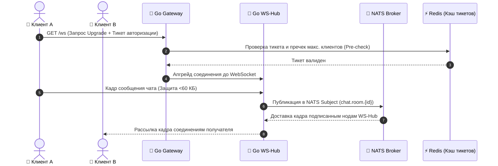

<div align="center">

# 🎓 Платформа Экосистемы Университета
### *Единый цифровой хаб для современного академического пространства*

<p align="center">
  <a href="README.md"><b>English 🇬🇧</b></a> • 
  <a href="README.ru.md"><b>Русский 🇷🇺</b></a>
</p>

[](https://opensource.org/licenses/MIT)
[](https://www.python.org/)
[](TESTING.md)
[](TESTING.md)
[](TESTING.md)
[](TESTING.md)
[](https://react.dev/)
[](https://vitejs.dev/)
[](https://go.dev/)
[](https://www.postgresql.org/)
[](SECURITY.md)

---

**University Ecosystem** — это высокопроизводительная полиглотразностная микросервисная платформа, созданная для объединения и автоматизации всех сфер университетской жизни. От расписания в реальном времени и навигации по кемпусу до корпоративной безопасности и автоматических воркфлоу.

[Документация](docs/README.md) • [Инструкция по деплою](docs/DEPLOY.md) • [Тестирование](TESTING.md) • [Безопасность](SECURITY.md) • [Вклад в проект](docs/CONTRIBUTING.md)

</div>

## 🌟 Ключевые возможности

> [!IMPORTANT]
> Платформа спроектирована с учетом требований к высокой масштабируемости, принципам Zero-Trust безопасности и устойчивости к экстремальным нагрузкам.

- 📅 **Динамический академический движок** – Расписание пар в реальном времени с параллельным разрешением конфликтов на **Rust (PyO3)** с использованием потоков Rayon.
- 💬 **Высоконагруженный WebSocket-хаб** – Мгновенный обмен сообщениями через **Go + NATS** с поддержкой горячей перезагрузки JWKS, лимитом 60 КБ на кадр и пречеками подключений.
- 🔒 **Управление правами на основе отношений (ReBAC)** – Гранулярный доступ на базе **SpiceDB** (Zanzibar architecture) и флаги фичей **OpenFeature** + **flagd**.
- 🖼️ **Медиа-процессинг и воркфлоу** – Асинхронная обработка файлов, оптимизация изображений и проверка на вирусы через **Go file-processor**, **Temporal.io**, **MinIO** и **ClamAV**.
- ⚡ **Вероятностное кэширование XFetch L1/L2** – Защита от «лавины кэша» (Cache Stampede) и Circuit Breakers в Redis/Valkey (`volatile-lru`).
- 🗺️ **Векторный поиск и навигация** – Семантический поиск по контенту и навигация по кемпусу с использованием **pgvector** и эмбеддингов.
- 📊 **Комплексный мониторинг (Observability)** – Сквозная трассировка (**OTEL + Tempo**), метрики (**Prometheus**), профилирование (**Pyroscope**) и централизованные логи (**Grafana Loki + Fluent Bit**).

## ⚡ Производительность и Бенчмарки

Полиглотная архитектура обеспечивает максимальную пропускную способность при минимальном потреблении ресурсов:

| Подсистема / Метрика | Чистый Python / Стандарт | Полиглотное ядро (Rust / Go) | Прирост производительности |
| :--- | :---: | :---: | :---: |
| **Разрешение конфликтов расписания** (10 000 элементов) | ~45.2 мс (1 поток) | **<0.98 мс** (Rust PyO3 + Rayon) | **~46x Быстрее** 🚀 |
| **Пропускная способность WS-чата (`ws-hub`)** | ~2 500 зап/сек | **10 000+ зап/сек** (<5мс задержка) | **4x Пропускная способность** ⚡ |
| **Обновление L1 кэша (`gateway`)** | Классический TTL (Риск лавины) | **XFetch Вероятностный Refresh** | **0 Лавин кэша** 🛡️ |
| **Размер бандла фронтенда** | ~1.4 МБ (Стандартный Rollup) | **<485 КБ** (Vite 8 / Rolldown + Oxc) | **65% Легче** 📦 |

## 📂 Структура проекта

```text
university_ecosystem/
├── app/               # 🐍 Core API (Python 3.14 / FastAPI) - Бизнес-логика и GraphQL
├── frontend/          # ⚛️ Современный Web UI (React 19 + Vite 8/Rolldown + Valibot)
├── services/
│   ├── gateway/       # 🚀 API Gateway (Go) - Авторизация, L1 XFetch кэш и лимиты
│   ├── ws-hub/        # 📡 WebSocket Hub (Go/NATS) - Чат и сообщения реального времени
│   ├── file-processor/# 📁 Media Engine (Go/Temporal) - Обработка файлов и медиа
│   └── caddy/         # 🔒 Обратный прокси и TLS терминация
├── native/            # 🦀 Rust-расширения (PyO3/Rayon) - Высокоскоростные вычисления
├── k8s/               # ☸️ Манифесты Kubernetes, Kyverno-политики и Chaos Mesh
├── alembic/           # 🗄️ Миграции базы данных (SQLAlchemy 2.0 Async)
└── docs/              # 📖 Архитектура и ADR (ADR-001 — ADR-032)
```

## 🧠 Архитектурная философия

Почему полиглотный стек?
- **Python (FastAPI & Python 3.14)**: Обеспечивает высокую скорость разработки бизнес-логики, внедрение зависимостей Dishka DI и богатую экосистему.
- **Go (Golang)**: Управляет I/O-интенсивными микросервисами (`gateway`, `ws-hub`, `file-processor`), выдерживая тысячи параллельных WebSocket-соединений и gRPC-стримов с минимальным потреблением ресурсов.
- **Rust (PyO3 & Rayon)**: Интегрирован прямо в Python для горячих вычислений (расчет конфликтов расписания), где важна каждая микросекунда.
- **SpiceDB (ReBAC)**: Реализует модель Zanzibar (например: *"Студент Х имеет доступ к Курсу Y, так как состоит в Группе Z"*).
- **Vite 8 & Rolldown**: Обеспечивает молниеносную сборку фронтенда, оптимизации React Compiler и бандлы менее 500 КБ.

## 🏗️ Архитектура и Сценарии Взаимодействия

### Топология системы



### 🔐 Сценарий Zero-Trust Аутентификации



### 📡 Сценарий Выборки и Отправки Сообщений в Чат



## 🛠️ Технологический стек

| Слой | Технологии | Роль | Гейт покрытия |
| :--- | :--- | :--- | :---: |
| **Frontend** | React 19, Vite 8/Rolldown, Valibot, Framer Motion, TanStack | Matte UX, доступность (WCAG 2.2 AA), PWA | **100%** |
| **Backend API** | FastAPI, Python 3.14, Dishka DI, SQLAlchemy 2.0, GraphQL | Основная бизнес-логика, REST и GraphQL API | **100%** |
| **Микросервисы** | Go 1.26, NATS, gRPC, Temporal Go SDK | Высоконагруженный чат и обработка медиа | **100%** |
| **Производительность**| Rust, PyO3, Rayon, Maturin | Нативное вычисление расписания и HMAC | **100%** |
| **Авторизация** | Argon2id, SpiceDB, WebAuthn/Passkeys, Kyverno, CSRF nonces | Zero-Trust ReBAC, аппаратная MFA и политики | Подтверждено |
| **Данные и Кэш** | PostgreSQL 17, pgvector, кэш Valkey (`volatile-lru`), revocation Valkey (AOF, `noeviction`) | Реляционные/векторные данные, вероятностный L1/L2 кэш и изолированный отзыв сессий | Подтверждено |
| **Observability** | OTEL, Tempo, Prometheus, Pyroscope 1.19, Loki + Alloy/Fluent Bit | Полный 360° мониторинг, трассы и логи | Подтверждено |

## 🚀 Быстрый старт

### 1. Подготовка окружения
Создайте локальное окружение из включённого шаблона. Загрузчик сгенерирует
секреты только для разработки, если значения отсутствуют; `.env` нельзя коммитить.
```powershell
Copy-Item .env.example .env
```

### 2. Запуск
Запуск всей экосистемы через загрузчик PowerShell 7. Скрипт генерирует локальные секреты, настраивает постоянную инфраструктуру, собирает образы и ожидает готовности всех рантаймов и таргетов Prometheus:
```powershell
.\start-docker.ps1 -Build
```

### 🌐 Точки доступа
- **Единый цифровой хаб (Caddy edge)**: [http://localhost](http://localhost)
- **Frontend SSR debug port**: [http://localhost:8081](http://localhost:8081)
- **Документация API**: [http://localhost:8000/docs](http://localhost:8000/docs)
- **Вход Go Gateway**: [http://localhost:8080](http://localhost:8080)
- **Real-Time сигнал**: `ws://localhost:8083/ws`
- **Центр наблюдаемости**: [Grafana](http://localhost:3000) · [Prometheus](http://localhost:9090) · [Pyroscope](http://localhost:4040)

## 🛡️ Безопасность и Стандарты Качества

- **Аппаратная аутентификация**: Поддержка **WebAuthn/FIDO2** (Passkeys) и хеширование паролей **Argon2id**.
- **Строгая валидация**: Схемы **Valibot** на фронтенде и защита от Path Traversal в gRPC.
- **Антивирусная защита**: Сканирование файлов в **ClamAV** перед сохранением в MinIO S3.
- **Политики K8s**: Инспекция подов через **Kyverno** и профили `RuntimeDefault`.
- **Очистка персональных данных**: Автоматическая анонимизация PII (почты, телефоны) в логах.

## 🧪 Инструкция для разработчиков

### **Python (Core API)**
```bash
uv sync            # Синхронизация зависимостей Python 3.14
uv run pytest      # Запуск тестовой сюиты (2800+ тестов)
uv run ruff check app/      # Проверка Ruff линтером
uv run ruff format app/     # Форматирование кода
```

### **React (Frontend)**
```bash
cd frontend
npm install        # Загрузка npm-пакетов
npm run dev        # Запуск Vite 8 dev-сервера
npx tsc --noEmit   # Проверка типов TypeScript
npm run test       # Запуск Vitest тестов
```

### **Go (Микросервисы)**
```bash
cd services/gateway
go test ./...      # Запуск модульных тестов Go
make test-integration # Запуск интеграционных тестов ADR-022
```

## 🔭 Наблюдаемость и Мониторинг

Платформа включает готовую к продакшену подсистему мониторинга:
- **OpenTelemetry & Tempo**: Сквозная распределенная трассировка микросервисов Go и FastAPI.
- **Prometheus**: Метрики в реальном времени, включая процент попаданий в L1-кэш (`cache_l1_hits_total`).
- **Pyroscope**: Непрерывное профилирование ресурсов процессора и памяти (`grafana/pyroscope:1.19.1`).
- **Grafana Loki + Fluent Bit**: Централизованный логгирование с анонимизацией персональных данных (ADR-012).

---

<div align="center">
  <br />
  <h3>Сконструировано с ❤️ инженерами University Ecosystem</h3>
  © 2026 University Ecosystem Platform • Все права защищены.
</div>
