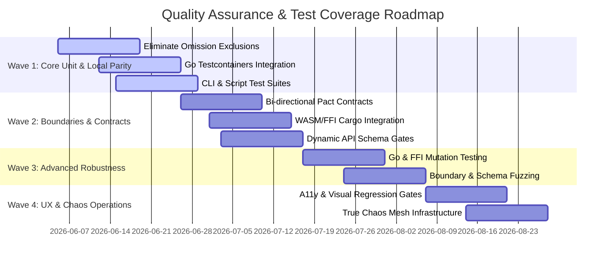

# Comprehensive Quality Assurance & Absolute Test Coverage Roadmap

This document outlines a multi-wave strategic roadmap to achieve absolute testing coverage, dynamic API validation, boundary fuzzing, and resilient quality gates across all layers of the University Ecosystem platform.

---

## Current Status Overview

- **Python Backend**: ~90% test coverage target enforced in CI/CD. However, critical infrastructure-dependent files (NATS broker, geolocation, file scanner, image proxy, etc.) are excluded from coverage measurements due to local database and queue dependencies.
- **Go Services**: ~80% coverage threshold enforced. Integration tests are currently advisory (non-blocking) and mock coverage is service-specific. Fuzzing is limited to a single parsing function.
- **Frontend**: ~90% unit coverage for stores and utilities. Playwright E2E and visual regression suites exist but lack full user flow scenarios and blocking gates.
- **Rust FFI Extension**: Basic PyO3 integration tests and 19 unit tests pass. Fuzzing targets are static.
- **FFI / WASM Crates (Untested)**: `frontend/rust-crypto`, `frontend/wasm-sanitizer`, and `crates/pyo3-sanitizer` contain Rust logic but are never tested via `cargo test` in CI/CD.
- **CLIs & Scripts (Untested/Omitted)**: `services/cmd/uni-cli` (Go CLI) is omitted from Go test matrices. `app/cli` (Python CLI), `app/management/`, and `app/scripts/` are excluded from python coverage.

---

---

## Wave 1: Core Unit Parity & Local Parity
*Focus: Eliminating code exclusions, upgrading Go integration gates, and achieving local developer environment parity.*

### 1.1 Eliminate Exclusions in Python Backend Coverage
- **Objective**: Remove the `omit` lists in [pyproject.toml](file:///c:/Users/egorribun/Documents/university_ecosystem/pyproject.toml) and test all high-risk files.
- **Execution**:
  - Write mock-based unit tests for `app/core/nats_broker.py` and `app/services/nats_messaging.py` using `unittest.mock` to simulate JetStream brokers.
  - Implement hermetic mocks for ClamAV (`app/services/file_scanner.py`) and libvips (`app/utils/images_vips.py`).
  - Achieve 95%+ total coverage on the Python backend, ensuring that no file is exempt from coverage gates.

### 1.2 Transition Go Integration Tests to `testcontainers-go`
- **Objective**: Standardize Go integration tests and elevate them from advisory to blocking.
- **Execution**:
  - Replace raw database/broker connection parameters in `go-integration-*` tests with dynamic containers spun up via `testcontainers-go` (PostgreSQL, Valkey, and NATS).
  - Update [.github/workflows/ci.yml](file:///c:/Users/egorribun/Documents/university_ecosystem/.github/workflows/ci.yml) to make Go integration jobs (`go-integration-gateway`, `go-integration-ws-hub`, `go-integration-file-processor`) blocking merge gates.

### 1.3 CLI and Script Coverage (Python & Go)
- **Objective**: Bring full unit and integration coverage to command-line interfaces and maintenance scripts.
- **Execution**:
  - **Go CLI (`services/cmd/uni-cli`)**:
    - Add `services/cmd/uni-cli` to the `go-tests` matrix in [.github/workflows/ci.yml](file:///c:/Users/egorribun/Documents/university_ecosystem/.github/workflows/ci.yml).
    - Write integration tests for CLI subcommands (`cache`, `health`, `metrics`) by mocking network endpoints and asserting exit codes and console output.
  - **Python CLI (`app/cli`) & Scripts (`app/management`, `app/scripts`)**:
    - Write command tests using Typer's `CliRunner`.
    - Create unit tests for DB maintenance/cleanup scripts under transaction rollbacks or SQL mocks.
    - Remove `app/cli/*`, `app/management/*`, and `app/scripts/*` from the `omit` list in `pyproject.toml`.

### 1.4 Local Dev Test Sandbox
- **Objective**: Allow developers to execute the full integration, load, and chaos test suites locally with a single command.
- **Execution**:
  - Build a PowerShell helper script (`scripts/run-test-sandbox.ps1`) that sets up local Postgres, Valkey, NATS, and MinIO instances, runs database migrations, compiles the Rust FFI extension, and runs the test suite.
  - Mitigate Windows/Linux path differences for Pyvips/Clamd during local runs.

---

## Wave 2: Boundary Alignment & Contract Verification
*Focus: Ensuring contract parity across API gates, gRPC protocols, and mock servers.*

### 2.1 Bi-Directional Pact Contract Expansion
- **Objective**: Cover all communication channels with strict, validated Pact contract suites.
- **Execution**:
  - Add consumers and providers for all gRPC connections between `gateway` and `file-processor`.
  - Add consumer contracts for NATS event streams between the Python backend (publisher) and `ws-hub` / `file-processor` (consumers).
  - Fix windows-specific library compatibility for `pact-python` by ensuring fallback mocking when execution happens outside of Linux.

### 2.2 FFI & WebAssembly Cargo Tests
- **Objective**: Test FFI and WASM business logic inside their native Rust environments.
- **Execution**:
  - Add unit tests for `crates/pyo3-sanitizer` and configure `cargo test --manifest-path crates/pyo3-sanitizer/Cargo.toml` in CI.
  - Add Cargo unit tests for `frontend/wasm-sanitizer` and `frontend/rust-crypto` in CI.
  - Add TypeScript unit tests using Vitest to verify that `frontend/src/workers/crypto.worker.ts` correctly instantiates and interacts with `uni_wasm_crypto` under JSDOM/Node environments instead of mocking it.

### 2.3 Dynamic API Schema Validation Gates
- **Objective**: Prevent breaking changes between backend REST APIs and frontend API clients at the pull request stage.
- **Execution**:
  - Integrate `schemathesis` into the CI pipeline to run stateful, schema-conforming tests against a running backend container.
  - Configure `openapi-diff` to compare the OpenAPI JSON generated on the PR branch with `origin/main` and fail if any backward-incompatible schema changes are detected.

### 2.4 MSW Mock Server Alignment
- **Objective**: Guarantee that frontend MSW (Mock Service Worker) handlers reflect the actual API behavior.
- **Execution**:
  - Automate MSW mock generation from OpenAPI spec using `msw-auto-mock` during the build phase.
  - Create integration tests in Vitest to run the frontend client directly against MSW handlers and assert schema consistency.

---

## Wave 3: Advanced Robustness, Security, & Mutation
*Focus: Uncovering logic bugs using mutation testing and validating boundary security with fuzzing.*

### 3.1 Go Mutation Testing (`go-mutesting`)
- **Objective**: Validate Go unit test quality by mutating Go source files and asserting that test suites fail on mutant survival.
- **Execution**:
  - Configure `go-mutesting` for the core business modules in `gateway`, `file-processor`, and `ws-hub`.
  - Add an incremental mutation verification step in `.github/workflows/reusable-go-tests.yml` to target only modified Go source files.

### 3.2 FFI Boundary and Schema Fuzzing
- **Objective**: Fuzz PyO3 interfaces and Go message parsers to prevent buffer overflows, leaks, or panic vectors.
- **Execution**:
  - Expand `cargo-fuzz` targets in `native/rust_ext` to test every PyO3 method (including conflict checks and signature validations) under random, malformed bytes.
  - Add an API fuzzing step using `Atheris` on the Python side to verify that parsing incoming JSON/Multipart payloads does not lead to unhandled internal crashes.

### 3.3 Memory Safety Sanitizers in CI/CD
- **Objective**: Prevent memory leaks and segmentation faults on FFI boundaries.
- **Execution**:
  - Build a custom FFI testing job using AddressSanitizer (ASan) and LeakSanitizer (LSan) inside the CI pipeline (`rust-ffi-asan` target).
  - Assert that all memory allocated by PyO3 on the Rust side is cleanly deallocated when Python garbage collects `ScheduleItem` instances.

---

## Wave 4: User Experience, Accessibility, & Operational Chaos
*Focus: Enforcing user-facing metrics, accessibility standards, and operational resilience under real failure scenarios.*

### 4.1 Accessibility (a11y) & Visual Regression blocking gates
- **Objective**: Enforce WCAG 2.2 AA accessibility compliance and prevent UI design regressions.
- **Execution**:
  - Configure `@axe-core/playwright` as a blocking gate during frontend end-to-end tests to scan pages for accessibility violations.
  - Set up visual regression snapshots in Playwright and enforce a visual diff threshold (e.g. max 0.5% pixel difference) for key pages (Login, Dashboard, Schedule Viewer).

### 4.2 Performance Budgets & Load SLO Gates
- **Objective**: Stop performance degradations from merging into production.
- **Execution**:
  - Enforce strict SLOs in `tests/performance/load_test.js` using `k6` thresholds:
    - `http_req_duration`: `p(95) < 200ms` (for gateway routes)
    - `http_req_failed`: `< 0.01%`
  - Automate these checks as blocking gates in [.github/workflows/ci.yml](file:///c:/Users/egorribun/Documents/university_ecosystem/.github/workflows/ci.yml).

### 4.3 True Chaos Engineering Infrastructure
- **Objective**: Move from Docker-based mock service shutdowns to true runtime chaos injection.
- **Execution**:
  - Deploy **Chaos Mesh** inside the development/staging Kubernetes environment.
  - Define automated chaos templates to inject latency (100ms - 500ms), packet loss (5%), pod evictions, and database failovers while running Playwright E2E smoke tests.
  - Validate that the outbox drains cleanly, the frontend handles server unavailability with graceful UI states, and no data is lost or duplicated.
